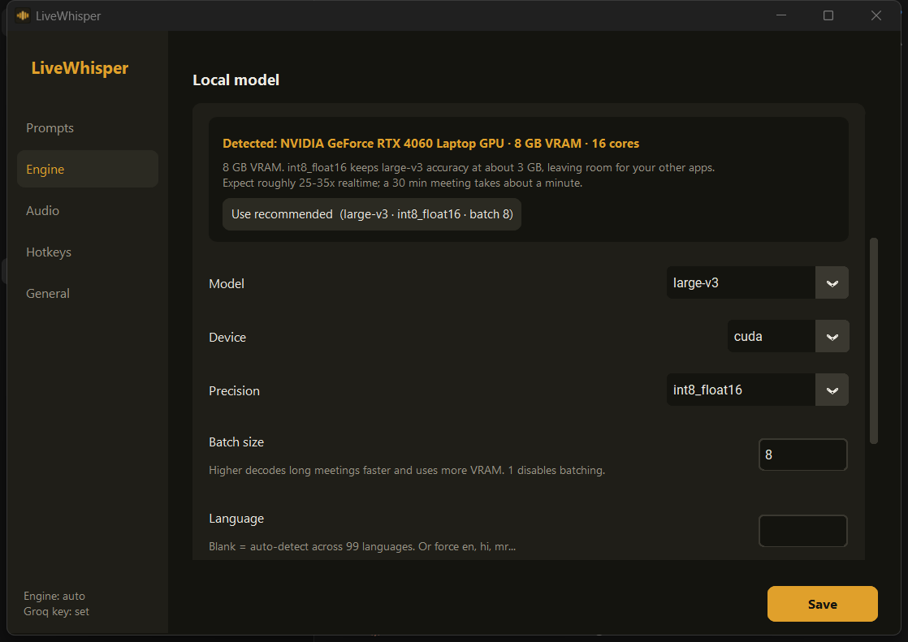

<div align="center">


# LiveWhisper

**Wispr Flow for system audio.** Press a hotkey to capture a meeting, press it
again to transcribe it, and the text lands wherever your cursor is.

Runs on your own GPU. Understands 99 languages. No subscription.



</div>

---

## What it does

Dictation tools transcribe **your microphone**. LiveWhisper transcribes **what
you hear** — the other participants on the call — and optionally your mic
alongside it, mixed into one track.

- **No virtual audio cable.** Captures system audio through WASAPI loopback, so
  your speakers keep working and nothing needs rerouting or admin rights.
- **Groq first, local fallback.** Uses the cloud when it is available and fast,
  and drops to a local model automatically when credit runs out, the key is
  rejected, or you are offline. You never get a failed transcription because a
  quota expired mid-meeting.
- **99 languages, auto-detected**, including speakers code-switching mid-call.
- **Prompt profiles.** The active profile's prompt is prepended to the
  transcript, so what you paste is ready to hand straight to an LLM.
- **Nothing is lost.** Every transcript is saved to disk. If transcription fails
  the raw audio is kept so you can retry it.

## Install

Requires Windows 10/11, an NVIDIA GPU for the local engine (optional if you use
Groq), and Python 3.10+.

```powershell
git clone https://github.com/YOUR-USERNAME/LiveWhisper.git
cd LiveWhisper
.\install.ps1
```

The installer detects your GPU, picks local-model settings that fit its VRAM,
asks for a Groq API key (optional), offers to pre-download the model, and
creates Start Menu and Desktop shortcuts. No admin rights; everything lives in
one folder.

```powershell
.\install.ps1 -InstallDir "E:\Apps\LiveWhisper" -Startup   # pick a location
.\install.ps1 -Unattended -SkipModel                       # no prompts
.\uninstall.ps1 -KeepTranscripts
```

Verify the environment at any time:

```powershell
.\.venv\Scripts\python.exe check_setup.py
```

## Hotkeys

| Hotkey | Action |
| --- | --- |
| `Ctrl+Alt+Space` | Start / stop recording |
| `Ctrl+Alt+X` | Discard the current recording |
| `Ctrl+Alt+P` | Next prompt profile |
| `Ctrl+Alt+G` | Switch engine (auto / groq / local) |

All rebindable in Settings. Recording is a **toggle, not push-to-talk** —
meetings are long.

While recording, a floating pill shows elapsed time and a live level meter.
The meter is the useful part: a flat line means the meeting audio is not
reaching you, and you find that out in the first ten seconds rather than after a
forty-minute call. Click the square to stop, the ✕ to discard, drag to move it,
or turn it off entirely in Settings.

## Prompt profiles

The active profile's prompt is prepended before pasting. With `Summarise` active
you get:

```
Summarise the key points and action items from this meeting transcript.
Note who committed to what, and flag anything left unresolved.

Transcript:

[the transcript]
```

Add, edit and delete profiles in **Settings → Prompts**.

## Engines

`auto` (default) sends to Groq and falls back to local. `groq` is cloud-only.
`local` never lets audio leave the machine — the right choice for a confidential
call.

When Groq refuses, LiveWhisper benches it for a cooldown period rather than
retrying and stalling every subsequent recording. Transient failures (a network
blip, a 5xx) do not trigger the bench.

### Measured

Identical audio through both engines on an RTX 4060 Laptop (`large-v3`,
`int8_float16`, `batch_size: 8`):

| Audio | Local | Groq | Saved | Groq cost |
| --- | --- | --- | --- | --- |
| 3 min | 7.9s | 2.9s | 5s | $0.002 |
| 30 min | 54.4s | 22.3s | 32s | $0.020 |

Word counts were identical at both lengths. Local runs at **27–33x realtime**.

Worth knowing: Groq's advertised 200x+ figure is throughput, not latency. Fixed
upload overhead dominates short clips, so the real-world gap is ~2.5x, not 10x.
**If privacy matters at all, stay local** — you are trading it for seconds.

## Hardware detection

The installer and **Settings → Engine** both detect your GPU and recommend
model, precision and batch size that will actually fit:

| VRAM | Recommendation |
| --- | --- |
| 10 GB+ | `large-v3` · `float16` · batch 16 |
| 6–10 GB | `large-v3` · `int8_float16` · batch 8 |
| 4–6 GB | `large-v3` · `int8` · batch 4 |
| 2–4 GB | `large-v3-turbo` · `int8` · batch 4 |
| CPU only | `small` · `int8` |

`large-v3` is preferred over `large-v3-turbo` wherever it fits. Turbo cuts
decoder layers 32→4 and is measurably worse on non-English audio, which matters
if your meetings are multilingual.

## Accuracy, measured

Tested on real recorded meetings, not read-aloud samples.

### English, multi-speaker

90 seconds of a public GitLab weekly meeting — a real Zoom call with several
speakers, compressed audio, and technical jargon. Both engines transcribed the
same captured audio independently:

| | Groq | Local `large-v3` |
| --- | --- | --- |
| Words | 215 | 212 |
| Word-level agreement | **98.6%** | |
| Substitutions | 0 | |
| Deletions | 3 (`it`, `is there`) | |

Zero substitutions. Two independently-run systems produced word-for-word
identical output apart from three dropped filler words, and both got "VS Code",
"Terraform module" and "MAU" right. Real meeting audio is not a problem.

### Hindi/English code-switching — read this if your meetings are Hinglish

This is where the engines diverge sharply. 75 seconds of a Hinglish podcast:

| Setting | Result |
| --- | --- |
| **Groq `large-v3`** (the default) | **Broken.** English transliterated into Devanagari: "that's your take" → "देट्स यॉर टेक", "MNCs are gonna shut shop" → "एम एन सीज आर गुण टो शट शॉप" |
| Groq `large-v3`, `language: hi` | No change — identical bad output |
| Groq `large-v3`, `language: en` | Clean, accurate English translation |
| Groq `turbo` | Clean English, but inverted a claim ("MNCs will create more startup jobs" — the speaker said the opposite) |
| **Local `large-v3`** | **Best.** Natural mixed script: `MNCs से ज़्यादा startup job create करेंगे, that's your take` |

Groq and local run nominally the same model, but Groq's hosted version commits to
one detected language and renders everything in that script. Locally the same
model code-switches correctly.

**If you take meetings in Hinglish** (or any code-switched pair), do one of:

- Set **Settings → Engine → Backend** to `local` — keeps natural mixed script,
  closest to what was actually said.
- Or set **Settings → Engine → Groq language** to `en` — fast, clean English
  translation, but you lose the original phrasing.

Do not leave Groq on auto-detect for code-switched audio.

### Names and jargon

The main error source in monolingual audio is proper nouns, not general
accuracy. In testing, `small` heard "Priya" as "PREA" and `large-v3` as "Preo".
Setting **Settings → Engine → Vocabulary** fixed it exactly:

```
Attendees: Priya, Marcus. Topics: database vendor, migration timeline.
```

If you have recurring meetings with the same people, set this once.

## Gotchas

- **Muting your speakers captures silence.** WASAPI loopback taps the stream
  *after* the master volume stage. Low volume is fine; mute yields nothing.
  LiveWhisper warns you rather than returning an empty transcript.
- **Your mic picks up the call through your speakers.** Harmless — both tracks
  are summed to mono — but lower `mic_gain` if the echo is bad.
- **`restore_clipboard` is off by default** so a failed auto-paste is
  recoverable with a manual `Ctrl+V`.

## How it works

```
audio.py       WASAPI loopback + mic capture, resample, mix to 16 kHz mono
transcribe.py  Groq / faster-whisper / auto-fallback behind one interface
overlay.py     floating recording pill
gui.py         settings window
hardware.py    GPU detection and model recommendation
output.py      clipboard + SendInput Ctrl+V
main.py        tray icon, hotkeys, state machine
```

Tk owns the main thread, pystray runs its message loop in a daemon thread, and
hotkey handlers run in their own short-lived threads.

One Windows-specific fix worth knowing about if you fork this: `pip install
nvidia-cudnn-cu12` puts its DLLs where CTranslate2 cannot find them, which fails
as `Could not locate cudnn_ops64_9.dll`. `livewhisper/_cuda.py` registers those
directories at import, which avoids a manual CUDA Toolkit install.

## Development

```powershell
python -m venv .venv; .\.venv\Scripts\activate
pip install -r requirements.txt

python check_setup.py                  # environment diagnostics
python test_e2e.py                     # capture -> transcribe -> paste
python test_fallback.py                # Groq -> local fallback behaviour
python bench.py --minutes 10           # decode throughput
python -m livewhisper.hardware         # what would be recommended here
python run.py -v                       # run with debug logging
```

## Licence

MIT
