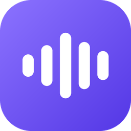

<div align="center">



# LiveWhisper

**Voice typing for the 1.6 billion people who type their language in English letters.**

You speak Hindi. You type `kya kar rahe ho`.
Every dictation app gives you `क्या कर रहे हो`.

*Hinglish · Tanglish · Banglish · Thanglish · Manglish · Punglish · and six more*

</div>

---

## The problem, in one line

Speech engines write the "correct" script. Nobody types the correct script.

```
   you say:            "kal main office jaunga"
   Whisper writes:      कल मैं ऑफिस जाऊंगा        ← correct Hindi. unusable in chat.
   LiveWhisper writes:  kal main office jaunga    ← what you'd have typed
```

There is **no way to ask a speech engine for romanized output**. We tested ten
different approaches and every one failed, so LiveWhisper converts the script
itself — and then learns the spellings *you personally* use.

## And a second problem nobody solves

Dictation tools **normalise** your writing: they add punctuation, fix
capitalisation, clean it up. But personal style *is* deviation from the norm, so
the whole category destroys the thing that makes text sound like you.

Wispr Flow's own documentation says it learns from your corrections but
explicitly discards *"capitalization-only changes"*. If you write in lowercase
on WhatsApp, it sees you delete that capital every single time — and throws the
signal away, because a word→word dictionary has nowhere to put "don't capitalise
in this app."

**LiveWhisper keeps what the others throw away.**

---

## Twelve languages

| | Language | Romanized as | Speakers | Lexicon coverage |
| --- | --- | --- | --- | --- |
| 🇮🇳 | Hindi | Hinglish | 610M | 87.3% |
| 🇧🇩 | Bengali | Banglish | 270M | 83.4% |
| 🇵🇰 | Urdu | Urdish | 230M | **92.1%** |
| 🇮🇳 | Punjabi | Punglish | 125M | 91.4% |
| 🇮🇳 | Marathi | Minglish | 83M | 90.9% |
| 🇮🇳 | Telugu | Thanglish | 83M | 86.2% |
| 🇮🇳 | Tamil | Tanglish | 79M | 86.9% |
| 🇮🇳 | Gujarati | Gujlish | 57M | 90.8% |
| 🇮🇳 | Kannada | Kanglish | 44M | 88.2% |
| 🇮🇳 | Malayalam | Manglish | 38M | 88.1% |
| 🇵🇰 | Sindhi | Sindhlish | 32M | 88.0% |
| 🇱🇰 | Sinhala | Singlish | 17M | 76.2% |

**87.4% average**, measured on running text, not a benchmark. It picks the
language from what you actually said — speak Tamil at work and Hindi at home
without touching a setting.

---

## Install

Windows 10/11 · Python 3.10+ · NVIDIA GPU recommended (works without)

**One line, nothing to clone:**

```powershell
irm https://raw.githubusercontent.com/itsskofficial/LiveWhisper/main/install.ps1 | iex
```

Or from a clone, if you'd rather read it first:

```powershell
git clone https://github.com/itsskofficial/LiveWhisper.git
cd LiveWhisper
.\install.ps1
```

The installer asks which language you type in, detects your GPU and picks a
model that fits it, and offers a Groq key for speed (optional — it runs fully
local without one).

A one-minute wizard then asks you to type a few sentences your way. That alone
teaches it most of your spelling habits. Skippable.

| Hotkey | |
| --- | --- |
| `Ctrl+Alt+Space` | Dictate |
| `Ctrl+Alt+W` | Speak an instruction — it reads your screen and writes the text |
| `Ctrl+Alt+F` | Fix grammar, *keeping* your lowercase and slang |
| `Ctrl+Alt+N` | Notes from system audio |
| `Ctrl+Alt+H` | Keep the next dictation in the original script |

---

## How it learns you

Correct `mujhe` → `muze` once. That isn't a fact about that word — it's a fact
about how you spell **ज**, and it applies to the **316 other words** containing
it.

We measured this across 30,000 words. Variation follows 1,200 letter-level
conventions, heavily concentrated:

| Corrections | Variation explained |
| --- | --- |
| 5 | 43.9% |
| **10** | **57.0%** |
| 20 | 70.5% |

**It does not watch you type.** At the start of your next dictation, before
pasting, it reads what's in that field and compares it with what it left there.
Nothing runs in the background.

**What it stores** is plain readable JSON — observed rates, not settings:

```json
"whatsapp.exe": { "habits": { "capitalize": 0.04, "terminal_period": 0.11 } },
"_global":      { "conventions": { "rules": { "jh": "z" } } }
```

Spelling is global; how you spell ज doesn't change between apps. Habits are
per-app; your WhatsApp voice isn't your email voice. **Settings → Writing**
shows exactly what it has learned, with a button to forget all of it.

### It refuses to learn nonsense

Type `too` for तू once and a naive system learns `u → oo`, which rewrites `aur`
as `aoor` and `bahut` as `bahoot` — **97% of affected words wrong**, measured.

So a rule needs two *different* words before it generalises, and even then it's
checked: a single Latin vowel stands for several native vowels, so replacing it
everywhere destroys the distinction. Consonants like `jh → z` map reliably and
pass. Rejected substitutions still apply to that one word.

---

## How it works

Three stages, and only one is a neural network:

```
  87% of words  →  dictionary lookup     instant · 17 MB · no AI
  13% of words  →  2.5M character model  runs on CPU
  every word    →  your own conventions  learned from your corrections
```

The dictionary is Google's [Dakshina](https://github.com/google-research-datasets/dakshina)
dataset — 350,000 words across twelve languages, with the Latin spellings real
people actually use.

**The hardest part isn't a model. It's a table.** That's why this is free and
instant where cloud tools charge monthly and count your words.

---

## Local by default

| | Local? |
| --- | --- |
| Audio capture | Always |
| Transcription | Yes — faster-whisper on your GPU, 27x realtime |
| Romanization + style | Yes — no network at all |
| Compose & grammar | Yes via Ollama — or Groq/OpenAI/Anthropic if you prefer |

No telemetry. No account. No word limits. Your profile is a file on your disk.

**Honest note:** local models are fine for grammar and short rewrites. For
longer composition a frontier model is noticeably better. Ollama support is a
real capability, not parity.

---

## Measured, not claimed

| | |
| --- | --- |
| Lexicon coverage, 12 languages | **87.4%** average on running text |
| Transcription | 27x realtime (`large-v3`, RTX 4060) |
| Character model (Hindi) | 63.2% exact match, 2.56M params, CPU |
| 10 corrections | 57% of spelling variation |
| Whisper → romanized via prompting | **Impossible** — 10 approaches, all failed |

Every number is reproducible from [`experiments/`](experiments/).

---

## "Isn't this already solved?"

Reasonable question. Three things look like they solve it and don't.

### Gboard already does transliteration

It does — **in the opposite direction.** Gboard lets you *type* `kya kar rahe ho`
and turns it into `क्या कर रहे हो`. That is roman → native.

LiveWhisper is native → roman, which is what you need when the *machine*
produces the text and you want it to look like you wrote it. Gboard's own voice
typing gives you Devanagari, same as everything else.

Different problem, opposite direction, and nobody was solving this one.

### Wispr Flow / Typeless / superwhisper

All excellent at English dictation, and all give you native script for Indic
languages because they use the same speech engines everyone does.

On style: Wispr Flow does read your corrections — but its documentation says it
keeps proper nouns and jargon while discarding *"capitalization-only changes"*
and style fixes. That is a deliberate design choice forced by its data model, a
flat word→word dictionary. Per-app style needs per-app profiles.

They are also cloud services with word limits and subscriptions. This is neither.

### Just ask Whisper for romanized output

The first thing we tried. It cannot be done — ten different approaches, all
failed, documented in [`experiments/exp1_romanized_prompt.py`](experiments/).

The closest attempt forces Whisper to *start* in Latin letters. It complies for
about thirty seconds and then reverts mid-sentence:

```
haan toh main ye keh raha tha ki, you were saying MNCs se zyada startup
job create karenge... mai batata hon because MNCs खरीद नहीं लेगी ...
```

Whisper decides the audio is Hindi, and to Whisper, Hindi *means* Devanagari.
You can nudge it. You cannot change its mind. That negative result is why the
conversion stage exists.

---

## Questions

**Is my audio sent anywhere?**
No. Capture and transcription run on your machine. Romanization and style
learning never touch the network at all. You can optionally point transcription
at Groq for speed, or the writing assistant at a cloud model — both are off by
default and clearly labelled.

**Does it work offline?**
Entirely, once the speech model is downloaded.

**What does it learn about me, and where does it go?**
A JSON file in the install directory containing spelling preferences and
observed rates like "capitalises 4% of the time in WhatsApp". It never stores
the text you wrote. Open it, edit it, delete it — **Settings → Writing** shows
all of it and has a Forget button.

**My language isn't listed.**
The twelve are the ones Google's Dakshina dataset covers, because a romanization
lexicon is the hard prerequisite. If you know of an equivalent dataset for
another language, open an issue — the pipeline itself is language-agnostic.

**The romanization is wrong for my language.**
Very possibly, and we'd like to know. Eleven of the twelve have never been
checked by a native speaker. There's an issue template for exactly this.

---

## Contributing

**The most valuable thing a native speaker can do** takes ten minutes: write
five natural chat-register sentences in your language for the setup wizard.
Hindi has them; the other eleven currently generate word prompts from the
lexicon instead, which works but is less good.

See [CONTRIBUTING.md](CONTRIBUTING.md) — it's a single file edit, and there's an
issue template that walks you through it.

Also wanted: curated common-word lists per language, macOS and Linux support,
and anyone who can tell us the romanization looks wrong for their language.

```powershell
python -m tools.check_data    # lexicon integrity, all 12 languages
python -m tools.check_core    # romanization, learning rules, profiles
python verify.py              # full readiness check, 22 checks
```

## Licence

Code MIT. The Dakshina lexicons in `data/` are CC BY-SA 4.0 — see
[data/LICENSE-DATA.md](data/LICENSE-DATA.md).
